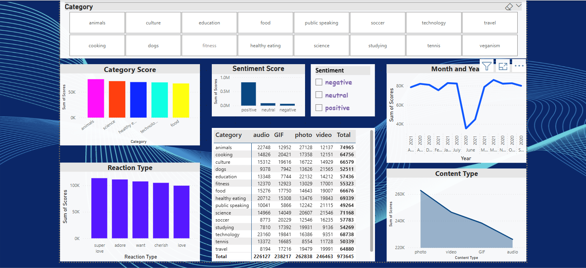

 
# Social Buzz Content Analysis
## Table of Contents
- [Project Overview](#project-overview)
- [Data Source](#data-source)
- [Problem Statement](#problem-statement)
- [Tools Used](#tools-used)
- [Skills Demonstrated](#skills-demonstrated)
- [Analysis & Visualizations](#analysis--visualizations)
- [Recommendations](#recommendations)

## Project Overview
Social Buzz is a content-driven platform with 500M+ users and 100K+ posts daily, powered by unique user reactions.
As growth accelerates, the platform faces major data and scaling challenges.
This project analyzes their content and reaction data to support smarter decisions and sustainable expansion. 

## Data Source
The datasets used in this analysis were provided by Social Buzz as part of a client briefing. The data was delivered in Excel format

## Problem Statement
Social Buzz's explosive growth to over 500M monthly users has introduced major challenges in managing and analyzing vast volumes of unstructured content data. As the platform scales, internal resources alone are no longer enough to handle its data complexity. This project addresses those gaps by uncovering actionable insights to support smarter, data-driven decisions and ensure long-term, scalable growth. 

## Tools Used 
1.	Excel [Data Cleaning /Transformation]
2.	Power BI [Data Analysis , Visualization]

## Skills Demonstrated 
### a.	Microsoft Excel [Data Cleaning & Transformation]
The dataset was cleaned and prepared using Microsoft Excel. Filters were applied to each column to identify and address missing values and duplicates. Redundant columns were removed to streamline the dataset. Quotation marks in the data category were cleaned using Excel’s Find and Replace feature. Lastly, the date and time fields were standardized by adjusting them to a consistent format for better analysis.

### b. Power BI [Data Visualization]

Using Power BI, I identified key performance indicators (KPIs) and developed visualizations to uncover insights about Social Buzz. Key visual findings include:
•	🔍 Reactions Breakdown by Reaction Type: A column bar chart highlights the wide range of user reactions, showcasing the platform’s emphasis on non-traditional engagement beyond likes and dislikes.
•	📈 Engagement Over Time: A line chart tracks the volume of reactions over time, revealing patterns such as peak engagement periods and trends in content virality.
•	🎯 Score by Category & Content Type: A matrix chart shows which content types perform best within each category. Analysis revealed the top 5 categories as [Animals, Science, Health Education, Technology, and Food].
•	🧠 Sentiment Analysis: A bar chart visualizes sentiment distribution, helping assess whether user reactions are generally positive or negative across different content types and categories. 

## Recommendations
- Users highly engage with feel-good, educational content like animals and science, showing a preference for emotionally rich themes.
- Photo content drives the most interaction, so prioritizing visual storytelling can boost overall performance.
- Reactions such as "super love" and "adore" dominate, indicating strong emotional investment that can guide content personalization.
- Seasonal dips suggest timing matters—data-driven scheduling and fresh content strategies could help sustain engagement year-round.

